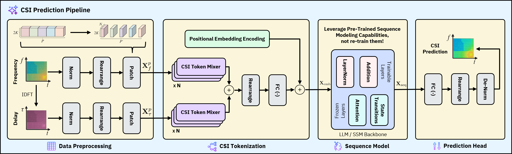
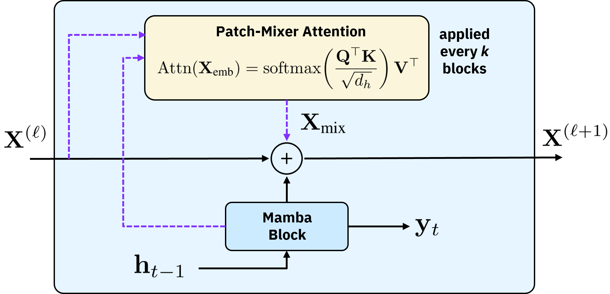

# MambaCSP 🐍 : Hybrid-Attention State Space Models for Hardware-Efficient Channel State Prediction

## Abstract 📜
Recent works have demonstrated that attention-based transformer and large language model (LLM) architectures can achieve strong channel state prediction (CSP) performance by capturing long-range temporal dependencies across channel state information (CSI) sequences. However, these models suffer from quadratic scaling in sequence length, leading to substantial computational cost, memory consumption, and inference latency, which limits their applicability in real-time and resource-constrained wireless deployments. In this paper, we investigate whether selective state space models (SSMs) can serve as a hardware-efficient alternative for CSI prediction. We propose MambaCSP, a hybrid-attention SSM architecture that replaces LLM-based prediction backbones with a linear-time Mamba model. To overcome the local-only dependencies of pure SSMs, we introduce lightweight patch-mixer attention layers that periodically inject cross-token attentions, helping with long-context CSI prediction. Extensive MISO-OFDM simulations show that MambaCSP improves prediction accuracy over LLM-based approaches by 9--12%, while delivering up to 3.0x higher throughput, 2.6x lower VRAM usage, and 2.9x faster inference. Our results demonstrate that hybrid state space architectures provide a promising direction for scalable and hardware-efficient AI-native CSI prediction in future wireless networks.

## CSI Prediction Pipeline ✨



<p align="center"><em>Proposed universal CSI prediction pipeline for both LLM and SSM architectures.</em></p>

## Hybrid-Attention MambaCSP Architecture 🧠

<div align="center">
  
  <p><em>Hybrid-attention MambaCSP block at layer l.</em></p>
</div>

## Highlights 🚀

- MambaCSP repository for DMRS channel prediction on time-frequency CSI tensors.
- End-to-end, reproducible experimentation flow: data generation, training, and test evaluation.
- Supports both GPT-2 style baselines and Mamba variants under TDD and FDD settings.
- Built for distributed multi-GPU training with mixed precision support.
- Includes checkpoints and results folders prepared for multiple speed-pattern scenarios.

## Contents 📚

- [Environment](#environment-⚙️)
- [Dataset Generation](#dataset-generation-dmrs-🧪)
- [Training](#training-🧱)
- [Testing](#testing-🔍)
- [Citation](#citation-📖)

## Environment ⚙️

- Tested with Python 3.10
- CUDA-capable NVIDIA GPU
- MATLAB with [QuaDRiGa](https://quadriga-channel-model.de/) for dataset generation
- Install dependencies:

```bash
pip install -r requirements.txt
```

## Dataset Generation (DMRS) 🧪

`dataset_generation.m` is the dataset entry point.

1. Open MATLAB and add QuaDRiGa/toolbox paths.
2. Edit `dataset_generation.m`:
   - `cfg.pattern_id = 1 | 2 | 3`
   - `cfg.duplex = 'TDD' | 'FDD'`
   - `cfg.out_root = './dmrs_datasets'` (default output root)
3. Run:

```matlab
>> run('dataset_generation.m')
```

4. Repeat for all three patterns and both duplex modes if needed.

### Output folder layout

Default output path:

```text
dmrs_datasets/<pattern_name>/<TDD|FDD>/
```

Expected files (must match training and testing scripts):

- `H_U_his_train.mat` (`H_U_his_train`)
- `H_U_pre_train.mat` (`H_U_pre_train`)
- `H_D_pre_train.mat` (`H_D_pre_train`)
- `H_U_his_test.mat` (`H_U_his_test`)
- `H_U_pre_test.mat` (`H_U_pre_test`)
- `H_D_pre_test.mat` (`H_D_pre_test`)
- optional metadata: `meta.mat`

Default pattern names:

- `pattern1_type1_sparse`
- `pattern2_type2_densefreq`
- `pattern3_highmob_dense`

`run_training.sh` and `test_dmrs.py` expect this exact layout.

## Training 🧱

Main training entrypoints:

- `train_dmrs.py`: DDP-aware trainer supporting GPT and Mamba backbones
- `run_training.sh`: Convenience launcher for batched experiments

### Batch training (recommended)

```bash
chmod +x run_training.sh
./run_training.sh
```

Default launch behavior:

- `NPROC=8`
- backbone: `gpt`
- all three default patterns
- both `TDD` and `FDD` for each pattern

### Selecting a backbone

- GPT:

```bash
BACKBONE=gpt ./run_training.sh
```

- Mamba (local):

```bash
BACKBONE=mamba ./run_training.sh
```

- Mamba with Hugging Face checkpoint:

```bash
BACKBONE=mamba USE_HF_MAMBA=1 HF_NAME=state-spaces/mamba-370m-hf ./run_training.sh
```

### Single-experiment command

```bash
torchrun --nproc_per_node 8 train_dmrs.py \
  --backbone gpt \
  --u2d 0 \
  --train-his ./dmrs_datasets/pattern1_type1_sparse/TDD/H_U_his_train.mat \
  --train-tgt ./dmrs_datasets/pattern1_type1_sparse/TDD/H_U_pre_train.mat \
  --save-path ./dmrs_model_weights/pattern1_type1_sparse/TDD/U2U_LLM4CP.pth
```

For FDD: use `--u2d 1` and `H_D_pre_train.mat` as `--train-tgt`.

### Few-shot mode

Enable with:

```bash
--few 1
```

This triggers few-shot data splitting from `Dataset_Pro`.

Default checkpoints:

```text
dmrs_model_weights/<pattern>/<TDD|FDD>/<U2U|U2D>_LLM4CP.pth
```

### DDP and AMP notes

- `train_dmrs.py` is launched with `torchrun` and is prepared for DDP.
- `DistributedSampler` provides shard-wise mini-batches for each process.
- Validation losses are reduced across ranks and checkpoints are saved by rank 0.
- AMP uses mixed precision and optional BF16 paths to reduce memory and improve throughput.

## Testing 🔍

Main entrypoint:

- `test_dmrs.py`

Example:

```bash
python test_dmrs.py \
  --backbone gpt \
  --data-root ./dmrs_datasets \
  --weight-root ./dmrs_model_weights \
  --results-root ./dmrs_results \
  --patterns pattern1_type1_sparse pattern2_type2_densefreq
```

Mamba evaluation example:

```bash
python test_dmrs.py \
  --backbone mamba \
  --use-hf-mamba \
  --hf-name state-spaces/mamba-370m-hf \
  --weight-root ./dmrs_model_weights \
  --weight-subdir mamba
```

Output files are stored under `dmrs_results/`, including:

- `<name>_tdd_<backbone>_nmse.csv`
- `<name>_tdd_<backbone>_se.csv`
- `<name>_tdd_<backbone>_se0.csv`
- `<name>_tdd_<backbone>_se_ratio.csv`
- corresponding FDD variants

`test_dmrs.py` evaluates all 10 user speeds by default.

## Citation 📖

If you use this repository, cite our paper:

```bibtex
@misc{mambacsp2026,
  title={MambaCSP: A Mamba-based CSI Prediction Framework for DMRS-based Channel Reconstruction},
  author={MambaCSP Authors},
  year={2026},
  note={Add final published/BibTeX entry here}
}
```
